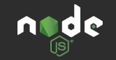

# Node.js 101 <!-- omit in toc -->

- [About this repository](#about-this-repository)
- [Lessons Learned](#lessons-learned)

## About this repository

* This repo was created to house basic examples and exercises I completed while learning the backend framework Node.js

## Lessons Learned

* How to create local modules and export desired information
* How to use core modules that are included with the Node.js framework
  * [Domain Name System (DNS)](https://nodejs.org/dist/latest/docs/api/dns.html#dns_dns)
  * [File system (Fs)](https://nodejs.org/dist/latest/docs/api/fs.html#fs_file_system)
  * [Path](https://nodejs.org/dist/latest/docs/api/path.html#path_path)
  * [Readline](https://nodejs.org/dist/latest/docs/api/readline.html#readline_readline)
* How to install and access third party modules
  * [NPM](https://www.npmjs.com/)
* [How to create a web server](https://learn.digitalcrafts.com/immersive/lessons/back-end-foundations/node-101/#creating-a-server)
* [Object Destructuring](https://developer.mozilla.org/en-US/docs/Web/JavaScript/Reference/Operators/Destructuring_assignment#Object_destructuring)
* Express
  * Library for Node.js.
* ADD
* MORE
* Later